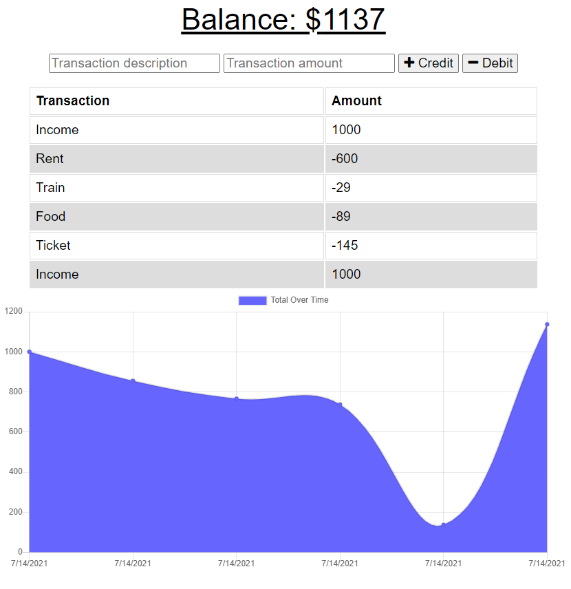

# Budget Tracker PWA

## Description:

Budget tracking progressive web application. You can add credits and debits to your budget with or without an internet connection. When entering transactions offline, your balance continues to be updated. When a connection is established, any transactions recorded while offline are uploaded and saved to the database on the remote server.

It uses _Mongo_ and _Express_ server-side.

It uses _IndexedDB_ with a _service worker_ and _cache_ client-side.

## Table of Contents:

- [Installation](#installation)
- [Usage](#usage)
- [License](#license)
- [Contributing](#contributing)
- [Questions](#questions)

### Installation

The deployed app can be accessed here: https://dandy-budget-tracker-pwa.herokuapp.com/

In Chrome, click `Install Budget Tracker` from the menu in the top right.

### Usage

For each transaction, enter a description, an amount and then click on whether you want to add or subtract funds from the balance.

### License

This repository is licensed under the [MIT](https://opensource.org/licenses/MIT) license.

### Contributing

No contributions at this time.

### Questions

If you have any questions, head to my [GitHub](https://github.com/DandyCodes) or send me an email at jdabarker@gmail.com.
